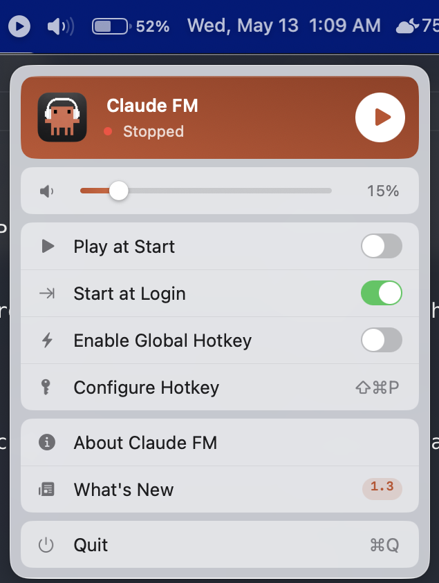

# Claude FM

A lightweight macOS menubar app that streams [Claude FM](https://www.youtube.com/live/YmQ7jRgf4f0) live audio.

Lives in your menubar. Left-click to play/pause. Right-click for the full menu. No dock icon, no windows, no bloat.

<p align="center">
  
</p>

## Features

- **Menubar player** — play/pause with a single click
- **Liquid Glass dropdown** — frosted-glass panel with a Now Playing card, inline volume, and iOS-style toggles
- **Play at Start** — auto-play when the app launches
- **Start at Login** — launch automatically on boot
- **Global hotkey** — toggle playback from any app (default: `⌘⇧P`)
- **Fully self-contained** — no Homebrew, no external dependencies

## Requirements

- macOS 13 (Ventura) or later
- Apple Silicon or Intel Mac (universal binary)

## Install

### From source

```bash
git clone https://github.com/apparelmagic-johnc/claudefm-client.git
cd claudefm-client
./Scripts/build-app.sh
cp -r "build/Claude FM.app" /Applications/
```

### Pre-built

Copy `Claude FM.app` to `/Applications/`. On first launch, right-click the app and select "Open" — macOS requires this once for apps not signed with a Developer ID certificate.

## Usage

| Action | What it does |
|--------|-------------|
| **Left-click** menubar icon | Toggle play/pause |
| **Right-click** menubar icon | Open dropdown menu |
| **⌘⇧P** (default) | Global hotkey — toggle playback from any app |

### Menu options

- **Now Playing card** — title, status indicator, play/pause button
- **Volume slider** — drag to adjust audio level
- **Play at Start** — auto-play when the app launches
- **Start at Login** — register as a login item
- **Enable Global Hotkey** — toggle the hotkey on/off
- **Configure Hotkey** — set a custom global keyboard shortcut
- **About Claude FM** — app info and version
- **What's New** — changelog
- **Quit** — exit the app

## Changelog

### 1.3.2 — 2026-05-13

**Fixed**
- Hidden audio player webview no longer reappears on screen after the display sleeps and wakes. The player's host `NSWindow` was parked at `(-10_000, -10_000)`, but AppKit's `constrainFrameRect(_:to:)` runs on display geometry changes (sleep/wake, monitor reconfig) and "rescues" fully off-screen windows back onto the active display. Window is now positioned on-screen with `alphaValue = 0` instead, which AppKit leaves alone.

### 1.3.1 — 2026-05-13

**Fixed**
- Stream no longer gets stuck on the loading spinner after a fresh launch — the auto-play guard added in 1.3 was too aggressive and discarded the prefetch's `ready` signal so `isPlayerReady` never flipped to true.
- Mid-playback buffering hangs (15s+) now mark the session as failed so a retry rebuilds the player, instead of looping against the stuck YT session.
- Hardened webview teardown — old webview now stops loading and clears its navigation delegate so a torn-down player can't fire stale `didFail` callbacks into the fresh session.

### 1.3 — 2026-05-13

**Improved**
- Liquid Glass interface overhaul — the right-click menubar dropdown is now a frosted-glass panel with a rust Now Playing card, inline volume slider, iOS-style toggles, and native keyboard-shortcut hints.
- Status icon scaled up to better match the visual weight of native menu extras.

**Fixed**
- A slow-but-not-failing network can no longer resurrect a session the user already gave up on — the playback-start timeout now clears the auto-play intent and late `ready` events are ignored.
- Spinner no longer renders at 30% opacity on offline → loading retry.
- Failed global-hotkey registrations (collision with an OS-reserved combo) now snap the toggle UI back to off instead of silently lying.

### 1.2.2 — 2026-05-11

**Fixed**
- Don't tear down an in-flight prefetch when you click play before it finishes — the player now distinguishes a load-in-progress from a confirmed failure.

### 1.2.1 — 2026-05-11

**Fixed**
- Recover automatically from a failed initial player load — clicking play again retries from scratch instead of getting stuck offline.
- Detect prolonged mid-playback buffering and surface it as offline after 15 seconds of no recovery.
- Harden the WebKit bridge to reject script messages from sub-frames.

### 1.2 — 2026-05-11

**Improved**
- Universal binary — runs natively on both Apple Silicon and Intel Macs.

### 1.1 — 2026-05-11

**Improved**
- Switched from yt-dlp to an embedded WebKit player for faster, more reliable streaming.
- No external dependencies required — fully self-contained app.

### 1.0 — 2026-05-11

**New**
- Menubar audio player for the Claude FM live stream.
- Volume control slider.
- Play at start option.
- Start at login support.
- Configurable global hotkey.
- About dialog with app icon.

## How it works

Claude FM uses an embedded WebKit view with the YouTube iframe API to stream audio from the Claude FM live broadcast. The WebKit view runs off-screen (no visible window) and only handles audio playback. No video is rendered.

## Building

Requires Xcode command line tools (`xcode-select --install`).

```bash
./Scripts/build-app.sh
```

This compiles with Swift Package Manager, assembles the `.app` bundle, and ad-hoc signs it. Output is at `build/Claude FM.app`.

## Tech stack

- **Swift** + **AppKit** — native macOS, no Electron
- **WebKit** — embedded YouTube iframe player for audio streaming
- **Carbon** — global hotkey registration (no Accessibility permissions needed)
- **ServiceManagement** — login item registration via `SMAppService`
- **Swift Package Manager** — build system

## Project structure

```
Sources/
  main.swift                   Entry point
  AppDelegate.swift            App lifecycle, settings init, auto-play
  StatusBarController.swift    Menubar icon, dropdown wiring, click handling
  LiquidGlassMenuPanel.swift   Frosted-glass dropdown — Now Playing card, volume, toggles
  StreamPlayer.swift           WebKit YouTube player, state machine
  PlayerState.swift            State enum with icon mapping
  Settings.swift               UserDefaults persistence
  HotkeyManager.swift          Carbon global hotkey registration
  HotkeyRecorderWindow.swift   Key combo capture UI
  LoginItemManager.swift       SMAppService wrapper
  FlippedView.swift            Shared top-down layout helper
  AboutWindow.swift            About dialog
  WhatsNewWindow.swift         Changelog dialog
```

## License

MIT

## Author

John Cioni
