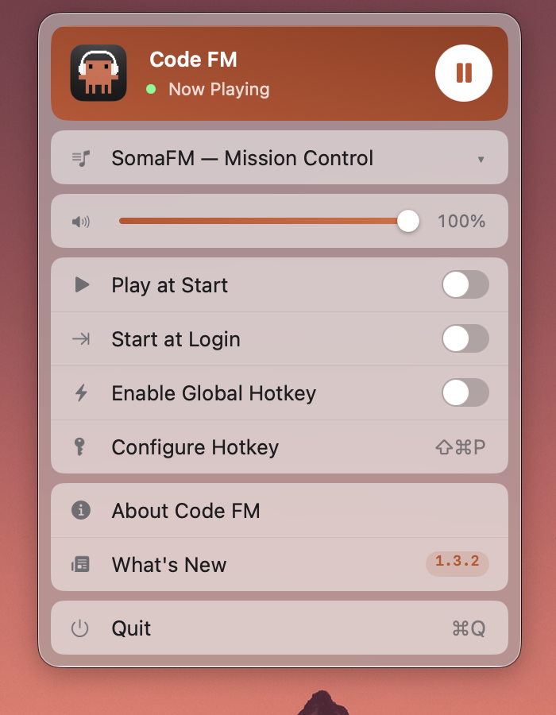

# Code FM

A lightweight macOS menubar app that streams a curated catalog of live stations: YouTube live streams and SomaFM.

Lives in your menubar. Left-click to play/pause. Right-click for the full menu. No dock icon, no main window, no bloat.

<p align="center">
  
</p>

## Features

- **Menubar player** — play/pause with a single click
- **Liquid Glass dropdown** — frosted-glass panel with a Now Playing card, inline volume, and iOS-style toggles
- **Station catalog** — 17 live stations across lo-fi, jazzhop, synthwave, ambient and brand groups; pick one from the menu or let it choose at random
- **Settings window** — browse the stream library, set a default station, and see which stations are offline
- **Play at Start** — auto-play when the app launches
- **Start at Login** — launch automatically on boot
- **Global hotkey** — toggle playback from any app (default: `⌘⇧P`)
- **Fully self-contained** — no Homebrew, no external dependencies

## Requirements

- macOS 13 (Ventura) or later
- Apple Silicon or Intel Mac (universal binary)

## Install

### From source

```bash
git clone https://github.com/johncioni/codefm.git
cd codefm
./Scripts/build-app.sh
cp -r "build/Code FM.app" /Applications/
```

### Pre-built

Download `Code-FM-<version>.zip` from the [latest release](https://github.com/johncioni/codefm/releases/latest), unzip it, and move `Code FM.app` to `/Applications/`.

The app is ad-hoc signed and not notarized. On macOS 15 or later, open the app once, then click **Open Anyway** in **System Settings > Privacy & Security**. On macOS 13 or 14, right-click the app and choose **Open**.

## Usage

| Action | What it does |
|--------|-------------|
| **Left-click** menubar icon | Toggle play/pause |
| **Right-click** menubar icon | Open dropdown menu |
| **⌘⇧P** (default) | Global hotkey — toggle playback from any app |

### Menu options

- **Now Playing card** — title, status indicator, play/pause button
- **Stream** — shows the current station and opens the station picker: Random, stations grouped by genre, and Open Stream Library
- **Volume slider** — drag to adjust audio level
- **Play at Start** — auto-play when the app launches
- **Start at Login** — register as a login item
- **Enable Global Hotkey** — toggle the hotkey on/off
- **Configure Hotkey** — opens Settings > General to set a custom global keyboard shortcut
- **About Code FM** — app info and version
- **What's New** — changelog
- **Quit** — exit the app

## Changelog

### 1.4.5 — 2026-10-08

**Improved**
- The Claude FM station is now named Anthropic — Claude FM, after its provider.

**Fixed**
- When the station list updates at launch, the station you have loaded picks up its new stream or name right away instead of at the next launch. A stopped station stays stopped.
- A YouTube station that pauses by itself no longer starts playing again on its own when Code FM finds the channel's new live stream.
- A YouTube station resumed with a media key no longer shows as playing with no sound after macOS ends its background web process. One click plays it again.

### 1.4.4 — 2026-10-08

**Improved**
- Lofi Girl's main and jazz stations play their current streams again. The 80s Guy darksynth and Pixar Soul lofi stations are removed because their streams ended, leaving 17 stations.

**Fixed**
- When a YouTube station's stream ends, Code FM switches only to a stream that is live right now, never to a recording or an old upload.
- Stations on channels that run several live streams, such as Lofi Girl and Chillhop, no longer switch to a different stream from the same channel. They show as offline until the station list is updated.
- A playing YouTube station recovers when macOS ends its background web process, instead of going offline.
- A stopped or offline YouTube station can no longer get stuck on loading and ignore clicks.

### 1.4.3 — 2026-10-08

**Fixed**
- A YouTube station is no longer marked offline, and hidden from the menu, while it is still recovering or after it has recovered.
- When a YouTube broadcast ends, Code FM switches to the channel's new broadcast if there is one, instead of marking the station offline.
- A YouTube station that isn't playing no longer goes offline when macOS ends its background web process.
- Pressing play on an offline YouTube station checks the channel for a new broadcast again.

### 1.4.2 — 2026-10-08

**Fixed**
- A stopped YouTube station no longer starts playing by itself when the app moves it to the channel's new live broadcast.

### 1.4.1 — 2026-10-08

**Fixed**
- Random at launch switches away from offline stations until playback starts or you choose a station.
- Offline stations stay hidden from the Stream menu after a catalog refresh, and random replacements skip them when another station is available.

### 1.4 — 2026-10-07

**New**
- Claude FM is now **Code FM** and installs as a new app. The bundle identifier changed from `com.claudefm.app` to `com.johncioni.codefm`, with preferences in the `com.johncioni.codefm.preferences` suite, so Claude FM settings and its login item do not carry over.
- Station catalog with 19 live stations in five groups (lo-fi, jazzhop, synthwave, ambient and brand): 11 YouTube live streams and 8 SomaFM stations, defined in `Resources/streams.json`.
- SomaFM stations play as direct audio through AVPlayer, with `.pls` and `.m3u` playlists resolved to their stream URLs.
- Station picker in the menubar panel: the Stream row opens a menu with Random, stations grouped by genre, and Open Stream Library.
- Settings window with a Stream Library grouped by genre, where you can play a station and set it as the default. Startup offers a random station on launch instead; General holds the hotkey recorder, replacing the standalone hotkey window.
- The catalog refreshes in the background at launch from this repo's `main` branch, with the bundled copy as fallback, so new stations arrive without an app update.

**Improved**
- Stream health monitor probes stations at launch, hides offline stations from the menu and from the menu's Random pick, and dims them in Settings. The current station shows an Offline pill when it drops.
- YouTube stations recover automatically when a live broadcast restarts under a new video ID by looking up the channel's current live stream.

**Fixed**
- Ended YouTube broadcasts are no longer treated as live.
- Settings no longer opens blank, and app windows no longer open behind the frontmost app.
- Newly bundled stations no longer stay hidden behind a stale cached catalog.
- The player warms up ahead of the first play again, restoring first-play latency, and playlists with CRLF line endings parse correctly.
- Stopping cancels a pending SomaFM playlist lookup, and turning off random-on-launch restores the previous default station.

### 1.3.2 — 2026-05-13

**Fixed**
- Hidden audio player webview no longer reappears on screen after the display sleeps and wakes. The player's host `NSWindow` was parked at `(-10_000, -10_000)`, but AppKit's `constrainFrameRect(_:to:)` runs on display geometry changes (sleep/wake, monitor reconfig) and "rescues" fully off-screen windows back onto the active display. Window is now positioned on-screen with `alphaValue = 0` instead, which AppKit leaves alone.

### 1.3.1 — 2026-05-13

**Fixed**
- Stream no longer gets stuck on the loading spinner after a fresh launch — the auto-play guard added in 1.3 was too aggressive and discarded the prefetch's `ready` signal so `isPlayerReady` never flipped to true.
- Mid-playback buffering hangs (15s+) now mark the session as failed so a retry rebuilds the player, instead of looping against the stuck YT session.
- Hardened webview teardown — old webview now stops loading and clears its navigation delegate so a torn-down player can't fire stale `didFail` callbacks into the fresh session.

### 1.3 — 2026-05-13

**Improved**
- Liquid Glass interface overhaul — the right-click menubar dropdown is now a frosted-glass panel with a rust Now Playing card, inline volume slider, iOS-style toggles, and native keyboard-shortcut hints.
- Status icon scaled up to better match the visual weight of native menu extras.

**Fixed**
- A slow-but-not-failing network can no longer resurrect a session the user already gave up on — the playback-start timeout now clears the auto-play intent and late `ready` events are ignored.
- Spinner no longer renders at 30% opacity on offline → loading retry.
- Failed global-hotkey registrations (collision with an OS-reserved combo) now snap the toggle UI back to off instead of silently lying.

### 1.2.2 — 2026-05-11

**Fixed**
- Don't tear down an in-flight prefetch when you click play before it finishes — the player now distinguishes a load-in-progress from a confirmed failure.

### 1.2.1 — 2026-05-11

**Fixed**
- Recover automatically from a failed initial player load — clicking play again retries from scratch instead of getting stuck offline.
- Detect prolonged mid-playback buffering and surface it as offline after 15 seconds of no recovery.
- Harden the WebKit bridge to reject script messages from sub-frames.

### 1.2 — 2026-05-11

**Improved**
- Universal binary — runs natively on both Apple Silicon and Intel Macs.

### 1.1 — 2026-05-11

**Improved**
- Switched from yt-dlp to an embedded WebKit player for faster, more reliable streaming.
- No external dependencies required — fully self-contained app.

### 1.0 — 2026-05-11

**New**
- Menubar audio player for the Code FM live stream.
- Volume control slider.
- Play at start option.
- Start at login support.
- Configurable global hotkey.
- About dialog with app icon.

## How it works

Code FM plays a curated catalog of live stations defined in `Resources/streams.json`. The app ships with that file, caches it in `~/Library/Application Support/Code FM/`, and refreshes it in the background from this repo's `main` branch, so new stations arrive without an app update.

YouTube live stations play through an embedded WebKit view running the YouTube iframe API. The view stays off-screen and renders no video. SomaFM stations are direct audio streams that AVPlayer plays, after resolving a `.pls` or `.m3u` playlist to its stream URL when the catalog points at one.

At launch, a health monitor probes every station. The menu and Settings refresh when a station goes down or comes back. Random picks from the menu and after a catalog refresh skip known offline stations when another station is available. A random launch station is provisional until it starts playing or you choose a station yourself: if it goes offline, the app picks another available station, preserving whether you asked it to play. If none are available, it keeps the current station.

## Building

Requires Xcode command line tools (`xcode-select --install`).

```bash
./Scripts/build-app.sh
```

This compiles with Swift Package Manager, assembles the `.app` bundle, and ad-hoc signs it. Output is at `build/Code FM.app`.

## Tech stack

- **Swift** + **AppKit** — native macOS, no Electron
- **WebKit** — embedded YouTube iframe player for YouTube live stations
- **AVFoundation** — `AVPlayer` for direct audio stations (SomaFM)
- **Carbon** — global hotkey registration (no Accessibility permissions needed)
- **ServiceManagement** — login item registration via `SMAppService`
- **Swift Package Manager** — build system

## Project structure

```
Sources/
  main.swift                      Entry point
  AppDelegate.swift               App lifecycle, settings init, auto-play
  StatusBarController.swift       Menubar icon, dropdown wiring, click handling
  LiquidGlassMenuPanel.swift      Frosted-glass dropdown — Now Playing card, volume, toggles
  StreamPlayer.swift              Owns the current station; creates its source and switches stations
  StreamSource.swift              Protocol for one playable audio source
  YouTubeStreamSource.swift       Off-screen WebKit player for YouTube live stations
  DirectAudioStreamSource.swift   AVPlayer for direct audio stations, PLS/M3U parsing
  Stream.swift                    Station model: type, subgenre, attribution
  StreamCatalog.swift             Catalog loading: bundled, cached, background refresh
  StreamHealthMonitor.swift       Tracks which stations are down
  RandomPicker.swift              Random station pick and the default-station rule
  PlayerState.swift               State enum with icon mapping
  Settings.swift                  UserDefaults persistence
  SettingsWindow.swift            Settings window: library, startup, general
  HotkeyManager.swift             Carbon global hotkey registration
  HotkeyRecorderView.swift        Key combo capture in Settings
  LoginItemManager.swift          SMAppService wrapper
  FlippedView.swift               Shared top-down layout helper
  AboutWindow.swift               About dialog
  WhatsNewWindow.swift            Changelog dialog
```

## License

MIT

## Author

John Cioni
